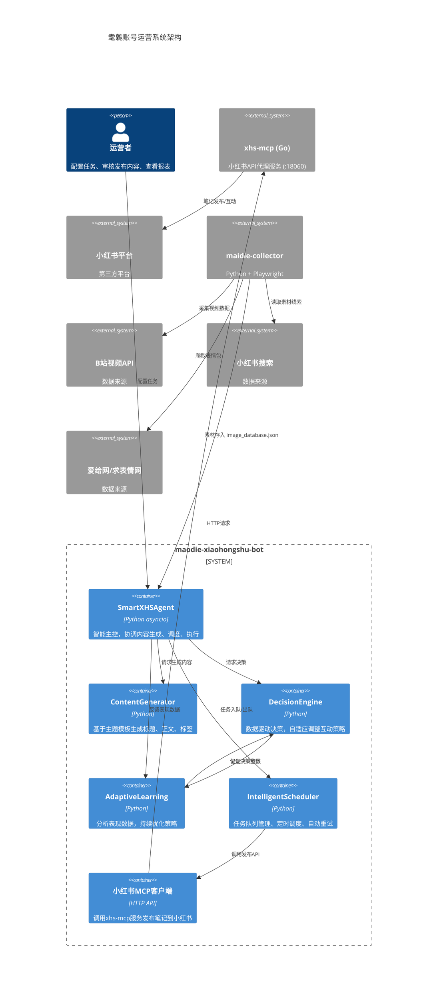

# 小红书耄臲账号运营系统架构



## 组件说明

| 组件 | 技术栈 | 职责 |
|------|--------|------|
| **SmartXHSAgent** | Python asyncio | 智能主控，协调各模块工作 |
| **ContentGenerator** | Python 模板引擎 | 生成标题、正文、标签 |
| **DecisionEngine** | Python | 决策是否互动、何时发布 |
| **AdaptiveLearning** | Python 数据分析 | 分析表现，优化策略 |
| **IntelligentScheduler** | Python | 任务队列、定时触发、自动重试 |
| **xhs-mcp** | HTTP API 客户端 | 调用 xhs-mcp 服务发布笔记 |
| **xhs-mcp (Go)** | Go 独立服务 | 绕过反爬，直接操作小红书API |
| **maidie-collector** | Python + Playwright | 采集耄臲素材（与本项目独立） |

## 数据流向

```
素材采集 (maidie-collector)
    ├── B站视频API → requests下载 → ffmpeg截帧
    ├── 小红书搜索 → xhs-mcp下载图片
    └── 爱给网/求表情网 → Playwright爬取
              ↓
    image_database.json (素材库)
              ↓
    SmartXHSAgent (读取待发图片)
              ↓
    ContentGenerator (生成标题/正文/标签)
              ↓
    IntelligentScheduler (定时发布)
              ↓
    xhs-mcp → 小红书平台 (发布笔记)
              ↓
    AdaptiveLearning (记录表现，优化策略)
```